# FCSG-Net technical report


## FCSG-Net


### Technical report

Frequency decomposition and spatial expert routing for composite RGB image restoration.

**Reporting date:** 01 October 2026. Experiment records are frozen at 03:45 IST, corresponding to 30 September 2026, 22:15 UTC. The study comprises Gaussian baseline evaluation, implementation verification, four completed composite training runs, checkpoint diagnostics, and an ongoing routing ablation.

Figure 1. FCSG-Net computation graph. Three shared spatial experts process every frequency band. Learned top-2 weights combine their outputs before channel fusion and residual refinement. Sources: models/fcsg.py and models/blocks.py.

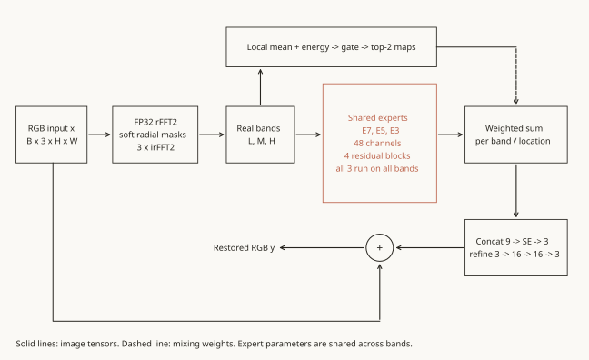

| FCSG-Net evaluation | Result |
| --- | --- |
| Composite restoration, 100 DIV2K images | 27.243 dB PSNR | 0.7529 SSIM | 0.3961 LPIPS |
| Model size and arithmetic at 256x256 | 97,088 parameters | 9.39 GFLOPs |
| T4 inference, FP32, batch 1, 256x256 | 19.40 ms median forward latency |

FCSG-Net satisfies the specified parameter and arithmetic budgets. Its completed checkpoint has lower PSNR and SSIM, higher LPIPS, and higher measured forward latency than the evaluated composite baselines.


## Abstract and contents


### Experimental summary

FCSG-Net decomposes an RGB input into three frequency bands and applies shared convolutional experts with 7x7, 5x5, and 3x3 kernels. A spatial gate selects two expert contributions per band and pixel. The study evaluates this architecture under a synthetic degradation model combining blur, resampling, Gaussian noise, and JPEG compression.

After 200,000 training steps, FCSG-Net achieves 27.242896 dB on 100 DIV2K validation images. DnCNN, blind FFDNet, and oracle FFDNet achieve 27.830859, 28.189947, and 28.239543 dB, respectively. FCSG-Net uses 82.6% fewer parameters and 87.2% fewer reported FLOPs than DnCNN. Median 256x256 forward latency is 19.40 ms for FCSG-Net, 18.04 ms for DnCNN, and 6.30 ms for blind FFDNet on Tesla T4.

Routing diagnostics cover ten images with eight degradation seeds per image. Spatial weights vary with image content and correlate with sampled degradation parameters. Inference substitutions reduce mean PSNR by 0.040 dB for equal weights on the selected pair and 0.372 dB for uniform weights across all experts. These results describe dependence on the trained routing policy; they do not establish the benefit of routing during training.

A matched, seeded reference and uniform-routing pair is in progress. Both runs target 100,000 steps. At the common 6,000-step validation, reference and uniform crop PSNR are 28.07 and 28.36 dB. Final full-image results and repeated-seed estimates are unavailable at the reporting cutoff.

| Pages | Contents |
| --- | --- |
| 3-8 | Research objectives, degradation model, network architecture, frequency decomposition, routing, and optimization |
| 9-14 | Implementation verification, Gaussian baseline, evaluation protocols, composite results, convergence, and optimization diagnostics |
| 15-21 | Per-image errors, qualitative comparisons, latency, memory, tiling, and routing diagnostics |
| 22-26 | Trained ablation, implementation issues, limitations, further experiments, provenance, and references |
| 27-29 | Per-image input and output PSNR for all 100 validation images |

Final composite metrics use 100 full validation images. Training validation uses 16 fixed crops. Diagnostic results use specified subsets or inference interventions. The active ablation has interim crop metrics only.


## Research objectives and prior work


### Objective and scope

The study tests spatial expert routing after explicit frequency decomposition under limits of 5 million parameters and 10 reported GFLOPs at 256x256. The experimental objectives are to verify the implementation, compare restoration quality with convolutional baselines, and characterize the learned routing policy.

Inputs and outputs are RGB images at the same spatial resolution. The degradation model approximates several forms of archival image corruption through synthetic blur, resampling, noise, and compression. Evaluation on real archival photographs and human perceptual assessment has not been performed.


### Related methods

| Reference | Relation to FCSG-Net |
| --- | --- |
| DnCNN [R1] | Residual convolutional baseline. The implemented network estimates a residual that is subtracted from the degraded input. |
| FFDNet [R2, R3] | Uses pixel rearrangement and a noise-level map. Author weights verify inference compatibility; the composite variants train from scratch. |
| MWCNN [R4] | Applies wavelet decomposition and reconstruction to image restoration. Explicit subband processing is established prior work. |
| SFNet [R5] | Uses content-dependent local frequency selection. FCSG-Net instead uses fixed radial input masks followed by spatial top-2 expert mixing. |
| Sparse mixture of experts [R6] | Provides a basis for sparse expert combinations. FCSG-Net uses sparse mixing weights but computes every expert output. |
| Squeeze-and-excitation [R7] | Provides the channel-attention mechanism used in the fusion stage. |
| LPIPS [R8] | Provides the perceptual-distance metric used alongside PSNR and SSIM. |

Published scores from these methods use different tasks, datasets, or noise protocols and are excluded from the matched composite comparison. The study evaluates a specific architecture and routing hypothesis. The available experiments do not support a state-of-the-art performance claim or an exhaustive novelty claim.

Project sources: plan.md and notes/related.md. Primary references appear on page 26.


## Data and degradation model

DIV2K contains 800 high-resolution training images and 100 validation images [R9]. The training cache contains 32 fixed 128x128 crops from each training image, or 25,600 uint8 tiles. The NumPy memory map contains 1,258,291,200 bytes of pixel data, approximately 1.26 GB, excluding its file header. Random flips and 90-degree rotations augment the cached crops.

Figure 2. Training pipeline. Loader workers sample degradation parameters for each augmented clean crop and return the degraded input, clean target, and parameter metadata. Sources: data.py, degrade.py, build_tiles.py, and the submitted training notebooks.

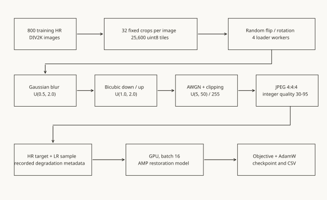

| Operation | Parameter distribution and implementation |
| --- | --- |
| Blur | Pillow GaussianBlur; sigma uniformly distributed over 0.5-2.0 pixels |
| Resampling | Scale uniformly distributed over 1.0-2.0; bicubic downsampling followed by upsampling to the original dimensions |
| Noise | Additive white Gaussian noise (AWGN); sigma uniformly distributed over 5-50 in 8-bit units; values clipped to [0,1] |
| JPEG | Integer quality 30-95 inclusive; RGB with subsampling=0, corresponding to 4:4:4 |

Quantization to uint8 precedes Pillow blur and JPEG encoding. Each sample records blur_sigma, scale, noise_sigma, and jpeg_quality. Validation fixes the NumPy RNG seed for each image. A separate D2 export contains 5,000 deterministic clean/degraded pairs; training samples degradation online rather than sampling exclusively from this export.


## Network architecture

Figure 3. Network data flow and tensor dependencies. Expert parameters are shared across bands. The band dimension is folded into the batch dimension before each expert forward pass.


```text
y = x + Refine(SEFusion(concat(y_L, y_M, y_H)))
```


```text
y_b(u,v) = sum_e w_b,e(u,v) * E_e(x_b)(u,v)
```

FrequencyDecompose returns a tensor of shape B x 3 bands x 3 channels x H x W. Three expert instances use 7x7, 5x5, and 3x3 kernels, respectively. Each expert processes all three bands. The weighted band outputs concatenate into nine channels. SEFusion maps these channels to RGB, followed by three 3x3 refinement convolutions with channel dimensions 3 -> 16 -> 16 -> 3.

| Module | Parameters |
| --- | --- |
| Shared 7x7 expert | 39,228 |
| Shared 5x5 expert | 30,012 |
| Shared 3x3 expert | 23,868 |
| Spatial gate, 18 -> 24 -> 9 | 681 |
| SE fusion and 9 -> 3 projection | 96 |
| Residual refinement | 3,203 |
| Total | 97,088 |

Kernel size specifies the expert architecture. Assigning an expert to a semantic category such as structure or texture would require separate attribution experiments. The routing analysis therefore identifies experts by kernel size.


## Frequency decomposition

Frequency decomposition uses an unshifted real FFT with orthonormal normalization. fftfreq and rfftfreq define frequencies in cycles per pixel. Radial frequency is sqrt(fx^2 + fy^2). Each frequency axis has a Nyquist limit of 0.5 cycles per pixel; the two-dimensional corner radius reaches approximately 0.707.

Figure 4. Raised-cosine frequency masks at cutoffs 0.10 and 0.25 cycles per pixel, with transition width 0.05. The right panel shows a centered frequency plane. Computation uses unshifted FFT ordering. Mask curves follow the implemented analytic formula.

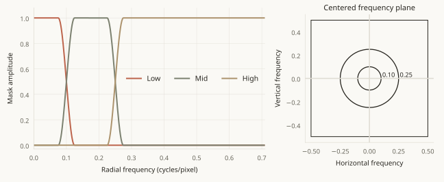


```text
t_c(r) = clip((r - c) / 0.05 + 0.5, 0, 1)
```


```text
LP_c(r) = 0.5 * (1 + cos(pi * t_c(r)))
```


```text
M_L = LP_0.10; M_M = LP_0.25 - LP_0.10; M_H = 1 - LP_0.25
```


```text
x_b = irFFT2(M_b * rFFT2(x)); sum_b x_b = x
```

The three masks sum to one. The implementation check measures a maximum band-reconstruction error of 5.96e-7 in FP32. A second check verifies matching sinusoidal responses at image sizes 128 and 256. Cutoffs expressed in cycles per pixel preserve the physical frequency definition across resolutions.

FFT operations execute in FP32 during mixed-precision training. This avoids half-precision CUDA FFT restrictions at odd and non-power-of-two dimensions. Inverse FFT converts each masked spectrum into a real spatial image before convolutional processing.

Patch and whole-image inference retain different FFT boundaries, routing context, and SE pooling context. The tile-size experiment on page 19 quantifies this dependence for the selected validation subset.


## Expert modules and spatial routing

Figure 5. Expert and gate operations. Experts use lossless pixel rearrangement and depthwise separable residual blocks. The gate pools RGB band statistics in 16x16 windows using ceil_mode. Replication padding handles odd image dimensions before rearrangement; outputs are cropped to the original size.


Pixel unshuffle maps each RGB band to 12 channels at half the original height and width. A 1x1 convolution maps 12 channels to 48. Four residual blocks each contain two depthwise convolution and pointwise convolution stages, with ReLU between the stages. A 1x1 tail maps 48 channels to 12 and adds the rearranged input. Pixel shuffle restores the RGB dimensions.

The gate combines three RGB bands into nine channels and pools local means and mean squares. The resulting 18 channels pass through a 1x1 MLP with dimensions 18 -> 24 -> 9 and an intermediate ReLU. Bilinear interpolation restores full-resolution logits. Temperature is 1.0. The two largest logits per band and pixel receive a softmax-normalized weight; the remaining weight is zero.


```text
w_b,e = exp(a_b,e) / sum_(j in top2) exp(a_b,j), if e in top2
```

Every expert output is computed before mixing. Three expert calls process B*3 band images, giving nine band/expert combinations. The implementation does not skip expert kernels at locations with zero mixing weights. Reported sparsity therefore concerns the combination weights rather than conditional computation.

Dense softmax probabilities over all three experts support entropy regularization. Near-uniform dense probabilities can still produce different selected pairs across the image when logit ranks change. Dense entropy alone is insufficient to characterize spatial selection.


## Optimization and training protocol

| Setting | Completed composite runs |
| --- | --- |
| Optimizer | AdamW; weight decay 0.0 |
| Learning rate | Cosine decay from 2e-4 to 1e-6 |
| Training | 200,000 updates; batch 16; 128x128 RGB crops |
| Execution | CUDA AMP FP16 with GradScaler; 4 persistent loader workers |
| Logging | Objective every 50 steps; validation and checkpoint every 2,000 steps |
| Randomness | Original training seeds are unfixed; validation seeds are fixed |


```text
L_char = mean(sqrt((pred - HR)^2 + 1e-6))
```


```text
L_freq = mean(abs(rFFT2(pred - HR, norm='ortho')))
```


```text
L_ent = sum_b mean_(batch,space)(sum_e p_b,e * log(p_b,e))
```


```text
L = L_char + 0.05 L_freq + 0.01 (1 - step/T) L_ent
```

All composite models use Charbonnier loss with epsilon 1e-3 and a frequency-loss coefficient of 0.05. Learned-routing FCSG-Net also uses negative dense entropy. Its coefficient decreases linearly from 0.01 to zero at the configured endpoint. The log records the positive entropy value, -L_ent, summed over bands.

Figure 6. Configured learning-rate and entropy-coefficient schedules for T=200,000. The seeded ablation uses the same schedule functions with T=100,000.

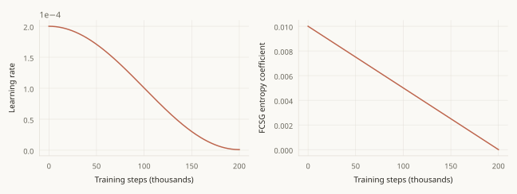

Frequency loss computes the magnitude of the FFT of the prediction residual, rather than the difference between two spectrum magnitudes. Checkpoints save model, optimizer, scaler, step, and configuration. RNG and sampler states are absent, so a resumed trajectory is not guaranteed to be bitwise identical to uninterrupted training.


## Implementation verification

Milestone verification completed on 23 September and was repeated on 25 September with the Phase 3 source changes. The second run used Tesla T4, Python 3.12.13, torch 2.10.0+cu128, CUDA 12.8, NumPy 2.0.2, and Pillow 11.3.0. The following results are taken from that run's JSON records.

| Check | Result |
| --- | --- |
| Band reconstruction | Maximum absolute error 5.960464e-7 |
| Frequency units and FFDNet noise map | Passed |
| Degradation reproducibility and rate | Byte-level repeatability passed; 233.03 samples/s with one CPU worker |
| Parameter limit | 97,088 < 5,000,000 |
| Arithmetic limit | 4.664494 profiled GMACs; 9.391903 GFLOPs with the FFT estimate |
| Forward and backward memory | 536.06 MB allocated; 597.69 MB reserved; batch 1, 256x256 FP32, including auxiliary tensors |
| Shape, gradients, routing, and odd-size AMP | Passed |
| Checkpoint restoration | Restored model output matches the saved model output exactly |

Figure 7. Single-image optimization over 200 updates. MSE decreases from 0.026092 to 0.004630 in 3.64 s, giving a final-to-initial ratio of 0.17745. Acceptance requires final MSE below 0.01 and below one-quarter of initial MSE. The final point is evaluated after the last update; the loss series is recorded before each update.


The deterministic D2 export contains 5,000 paired crops at seed 1234 and completes in 545.05 s. Archive and manifest hashes appear on page 25. The reported memory check measures batch-1 verification and does not measure peak batch-16 training memory.


## Gaussian denoising baseline

The initial RGB DnCNN experiment uses Gaussian noise at sigma 25 and clips noisy inputs to [0,1]. Evaluation uses checkpoint 286,000 from a planned 300,000-step run. The surviving training log extends to step 287,750, but no evaluation result for that later step is recorded.

Figure 8. Gaussian-run objective and fixed-crop validation PSNR. The 132,650-210,050 interval contains no surviving log entries. Curves are segmented at this gap and at a checkpoint rewind to avoid interpolating unobserved training behavior.

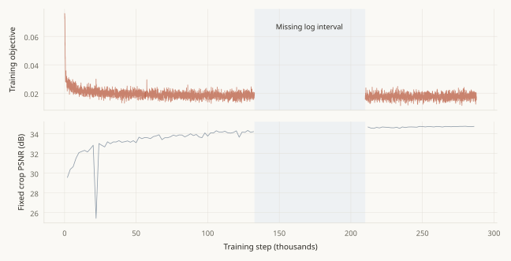

| Evaluation setting | Images | Input PSNR | Output PSNR |
| --- | --- | --- | --- |
| CBSD68 RGB; clipped Gaussian sigma 25 | 68 | 20.534 dB | 31.043 dB |
| DIV2K validation RGB; clipped Gaussian sigma 25 | 100 | 20.698 dB | 32.646 dB |

The available CSV contains 4,324 rows: 4,220 objective observations and 104 crop-validation observations. Maximum recorded crop PSNR is 34.747 dB at step 280,000. The log includes a rewind from step 56,600 to 56,050 and a missing interval of 77,400 steps. Consequently, the full optimization history cannot be reconstructed.

The original loader decodes a high-resolution PNG for each crop. Recorded throughput is approximately 1.8 steps/s during parts of this run. Later throughput measurements use cached tiles and composite degradation. Their different conditions prevent attribution of the entire throughput difference to caching alone.

Historical benchmark rows contain no SSIM, LPIPS, or GFLOP measurements. Clipping also distinguishes this experiment from the published unclipped color-denoising protocol. The historical DnCNN score is therefore retained as a separate baseline setting.


## Evaluation protocols and metrics

| Protocol | Data and computation | Interpretation |
| --- | --- | --- |
| Training validation | 16 fixed augmented 128x128 crops; crop and degradation seed 1234 | Monitors optimization on a fixed crop sample |
| Composite evaluation | 100 sorted DIV2K validation images; whole-image degradation seed equals image index; tile 256, overlap 32 | Final per-image means; restored values clipped to [0,1] |
| Author FFDNet reproduction | All 68 clean CBSD68 images; unclipped Gaussian sigma 25; RandomState(0) reset per image; whole-image inference | Author-pretrained checkpoint; output clamped and quantized to uint8 |
| Checkpoint diagnostics | 10 fixed validation images; original image-index seeds; 80 center-crop routing samples | Subset measurements and inference interventions |


```text
MSE_i = mean_RGB,pixels((prediction_i - target_i)^2)
```


```text
PSNR_i = 10 log10(1 / MSE_i); score = mean_i(PSNR_i)
```

Dataset PSNR is the arithmetic mean of per-image RGB PSNR. Its conversion to linear error does not recover pooled pixel MSE. Per-image RMSE on page 15 is calculated separately from each rounded PSNR observation.

PSNR denotes peak signal-to-noise ratio. Structural similarity (SSIM) uses an 11x11 Gaussian window with sigma 1.5 and valid convolution. Constants are C1=0.01^2 and C2=0.03^2. The implementation averages channel and spatial values. Learned perceptual image patch similarity (LPIPS) uses AlexNet features [R8] with inputs scaled to [-1,1]. Lower LPIPS indicates smaller perceptual distance. The metric network is excluded from restoration-model parameter counts.


### FFDNet protocol reproduction

Author-pretrained FFDNet achieves 31.219812 dB on the 68 CBSD68 images. The paper reports 31.21 dB for color denoising at sigma 25 [R2]. The absolute difference is 0.009812 dB, within the specified 0.5 dB tolerance. This comparison verifies checkpoint compatibility and inference implementation; it does not reproduce training from scratch.

Sources: evaluation/eval.py, src/fcsg_net/metrics.py, ffdnet_evaluation.json, phase1_provenance.json, and the author's inference implementation [R3].


## Composite restoration results

Each model completes 200,000 updates on the composite degradation distribution. Final evaluation uses the same 100 DIV2K images, per-image degradation seeds, and tiled inference policy. Mean input PSNR is 20.992 dB. FFDNet variants differ in their supplied noise-level map.

| Model | PSNR dB | SSIM | LPIPS | GFLOPs | Params |
| --- | --- | --- | --- | --- | --- |
| FCSG-Net | 27.243 | 0.7529 | 0.3961 | 9.39 | 97,088 |
| DnCNN | 27.831 | 0.7795 | 0.3242 | 73.43 | 558,403 |
| FFDNet blind | 28.190 | 0.7899 | 0.3176 | 27.89 | 852,108 |
| FFDNet oracle | 28.240 | 0.7920 | 0.3162 | 27.89 | 852,108 |

Figure 9. Final PSNR, SSIM, and LPIPS averaged over 100 validation images. Each model represents one training run. Higher PSNR and SSIM indicate better restoration fidelity; lower LPIPS indicates smaller perceptual distance.

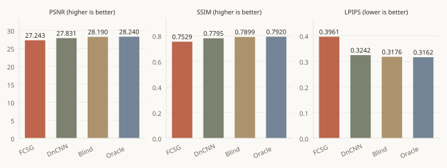

Oracle FFDNet receives the sampled AWGN sigma before JPEG compression. Blind FFDNet receives a constant map of 27.5/255 during training and evaluation. The blind variant does not estimate noise. Relative to blind FFDNet, the oracle variant gains 0.0496 dB PSNR and 0.00215 SSIM, with LPIPS lower by 0.00142.

| Comparison | FCSG PSNR difference | FCSG FLOP reduction |
| --- | --- | --- |
| DnCNN | -0.588 dB | 87.2% |
| Blind FFDNet | -0.947 dB | 66.3% |
| Oracle FFDNet | -0.997 dB | 66.3% |

The original runs have unfixed training seeds and no repeated-seed observations. Differences describe these checkpoints rather than estimates of average performance across random initializations. Equal update counts do not equalize parameter capacity or GPU time.


## Convergence and training throughput

Figure 10. PSNR on the fixed 16-crop validation sample against optimizer updates and training-loop time. Training-loop time includes validation, checkpoint writes, and data-loading delays. These curves use a different evaluation sample from the final 100-image benchmark.


| Model | Training hours | Final crop dB | Maximum crop dB |
| --- | --- | --- | --- |
| FCSG-Net | 10.055 | 30.592 | 30.592 |
| DnCNN | 6.657 | 31.664 | 31.688 |
| FFDNet blind | 2.044 | 31.969 | 31.997 |
| FFDNet oracle | 2.325 | 32.054 | 32.084 |

The four training loops total 21.082 recorded hours. Notebook setup, tile-cache construction, final full-image evaluation, and checkpoint diagnostics are outside this total. It therefore understates total GPU-session consumption.

A separate 1,000-step throughput test excludes the first 200 updates and validation/checkpoint intervals. The test measures DnCNN at 9.41 steps/s, FFDNet at 26.67 steps/s, and FCSG-Net at 5.84 steps/s on T4. Late crop-validation curves approach a plateau. The observations do not establish that extending the same training configuration would close the final quality gap.


## Optimization diagnostics

Figure 11. Total training objectives. Faint curves show subsampled minibatch observations. Solid curves average 50 consecutive logged minibatches, corresponding to 2,500 optimizer steps. Vertical scales differ across panels.

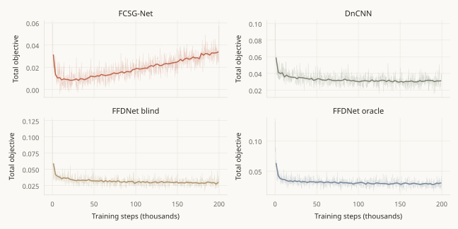

The FCSG-Net objective includes negative entropy with a time-dependent coefficient. Its magnitude is therefore not directly comparable with objectives that omit this term. Cross-model restoration comparisons use the validation metrics rather than the training objective.

Figure 12. Dense routing entropy summed over three bands during training. The maximum is 3 ln(3)=3.29584 nats. Observations use training minibatches rather than the final routing diagnostic sample.

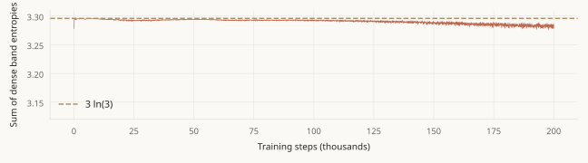

Charbonnier, frequency, and entropy loss components are not logged separately. Their individual trajectories and gradient contributions cannot be recovered. The records also lack dedicated NaN counts and gradient-norm histories.

The completed routing diagnostic measures mean dense band entropies of 1.08898, 1.09639, and 1.09729 nats, compared with ln(3)=1.09861. Mean sparse entropies are 0.68422, 0.69131, and 0.69178 nats, compared with ln(2)=0.69315. Spatial expert-pair selection remains variable despite these high entropy values.


## Per-image error analysis

Figure 13. Paired PSNR differences for the 100 validation images and model-specific RMSE distributions. RMSE = 255*10^(-PSNR/20), using PSNR rounded to 0.01 dB. Each RMSE curve sorts its own observations; equal ranks do not necessarily correspond to the same image.


| FCSG comparison | Wins / ties / losses | Mean difference | Difference range |
| --- | --- | --- | --- |
| DnCNN | 6 / 1 / 93 | -0.5877 dB | -2.75 to +2.07 dB |
| FFDNet blind | 0 / 0 / 100 | -0.9467 dB | -3.12 to -0.04 dB |
| FFDNet oracle | 0 / 0 / 100 | -0.9959 dB | -3.48 to -0.07 dB |

Both FFDNet variants exceed FCSG-Net PSNR on all 100 images. Against DnCNN, FCSG-Net records six wins, one tie at displayed precision, and 93 losses. Its minimum PSNR is 17.93 dB on 0828.png, which is also the lowest-scoring image for each baseline. The current experiment does not isolate the degradation factor responsible for this case.

DnCNN has three images with rounded output PSNR below input PSNR. The other models have no such observations. PSNR measures mean squared error and does not independently establish human visual preference or preservation of fine detail.

Appendix pages 27-29 list all input and output PSNR observations. Per-image SSIM and LPIPS are included in per_image_scores.csv. Aggregate evaluation JSON retains the original numerical precision; the per-image table is reconstructed from rounded console output.


## Qualitative results: FCSG and DnCNN

The first two validation images are 0801.png and 0802.png. Columns show the degraded input, restored image, and clean target. Panels display the top-left 320x320 region. The PSNR labels refer to complete images, rather than the displayed regions. Degradation seeds are identical across models.


### FCSG-Net, 200,000 steps

Figure 14. FCSG-Net restoration panels. Source: results/phase3/fcsg/figures/qualitative.png.

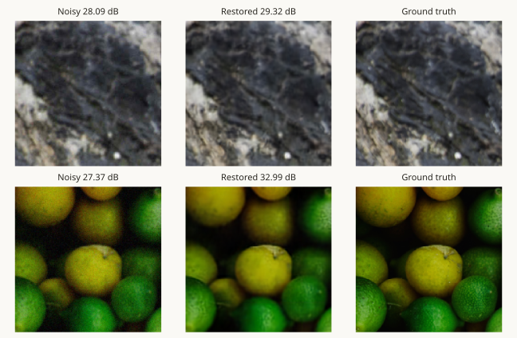


### DnCNN, 200,000 steps

Figure 15. DnCNN restoration panels. Source: results/phase3/dncnn_composite/figures/qualitative.png.


## Qualitative results: FFDNet

The FFDNet panels use the same image regions and degradation seeds as page 16. These examples supplement the 100-image quantitative evaluation. The saved evaluation output contains no local-region PSNR or difference images.


### Blind FFDNet, constant sigma 27.5/255

Figure 16. Blind FFDNet restoration panels. Source: results/phase3/ffdnet_blind/figures/qualitative.png.


### Oracle FFDNet, sampled noise sigma

Figure 17. Oracle FFDNet restoration panels. Source: results/phase3/ffdnet_composite/figures/qualitative.png.

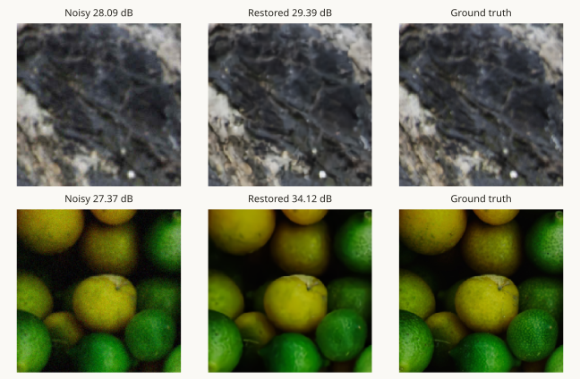


## Computational cost and inference

Figure 18. Full-validation PSNR against reported arithmetic and measured forward latency. Latency is measured independently with a batch-1 microbenchmark. The FFDNet variants have nearly identical computational cost.

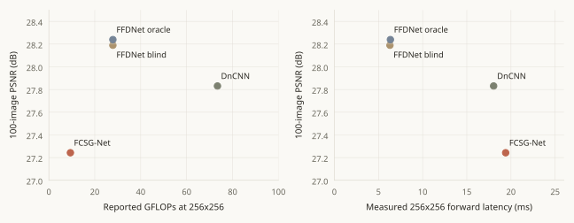

| Model | 128 ms | 256 ms | 512 ms | 256 peak MB |
| --- | --- | --- | --- | --- |
| FCSG-Net | 5.104 | 19.399 | 75.594 | 51.26 |
| DnCNN | 4.224 | 18.037 | 72.471 | 37.80 |
| FFDNet blind | 1.687 | 6.298 | 24.124 | 20.19 |
| FFDNet oracle | 1.688 | 6.348 | 24.620 | 20.19 |

Figure 19. Median forward latency and peak PyTorch inference allocation at three square input sizes. Memory uses decimal megabytes and batch 1. The forward/backward implementation check on page 9 uses different execution conditions.

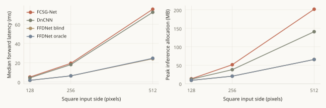

The microbenchmark uses Tesla T4, torch 2.10.0+cu128, FP32 with TF32 disabled, batch 1, 20 warmup passes, and 50 timed repetitions per size. Values are synchronized wall-clock medians. GPU-event medians and wall-clock p90 values are preserved in summary.json. Image transfer, degradation, metrics, and tile assembly are excluded.

Arithmetic accounting treats one multiply-accumulate (MAC) as two floating-point operations (FLOPs). It adds the FCSG FFT estimate 12*5*N*log2(N), where N=256^2. Small elementwise operations are excluded. This estimate satisfies the specified 10 GFLOP limit, but does not represent all hardware costs. No operator-level profile or end-to-end deployment latency is available.


## Tiled inference sensitivity

Composite evaluation uses 256x256 tiles with 32-pixel overlap and stride 224. Final tiles are anchored to image boundaries. Outputs are summed and divided by the coverage count at each pixel. Overlap blending uses uniform averaging.

Figure 20. Tile-size sensitivity with overlap fixed at 32 pixels. PSNR differences are paired against tile size 256 using identical whole-image degradations. The adjacent diagram specifies the 256-pixel tile and 32-pixel overlap geometry.

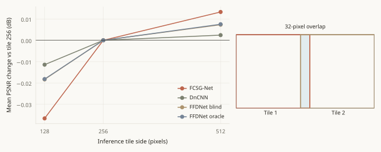

| Model | Tile 128 PSNR | Tile 256 PSNR | Tile 512 PSNR |
| --- | --- | --- | --- |
| FCSG-Net | 26.622078 | 26.658692 | 26.671968 |
| DnCNN | 27.329545 | 27.340980 | 27.343403 |
| FFDNet blind | 27.695521 | 27.713856 | 27.721162 |
| FFDNet oracle | 27.730054 | 27.748235 | 27.755767 |

The ten-image subset uses validation indices 0, 11, 22, 33, 44, 55, 66, 77, 88, and 99, corresponding to images 0801, 0812, 0823, 0834, 0845, 0856, 0867, 0878, 0889, and 0900. Four models and three tile sizes produce 120 measurements.

Increasing the tile size from 256 to 512 improves mean FCSG-Net PSNR by 0.013276 dB. DnCNN improves by 0.002423 dB; each FFDNet variant improves by approximately 0.0075 dB. The FCSG-Net change is smaller than its 0.6-1.0 dB deficit in the full composite comparison.

The ten-image tile-256 FCSG-Net mean is 26.658692 dB. The 100-image mean is 27.242896 dB. These different sample means describe distinct evaluation populations. Whole-image FCSG-Net inference and seam-local error measurements are unavailable.


## Spatial routing statistics

Figure 21. Average sparse weights and expert-selection fractions over 80 samples. Each sample is a 256x256 center crop extracted after whole-image degradation. Selection fractions sum to two within each band because two experts are selected at each pixel.

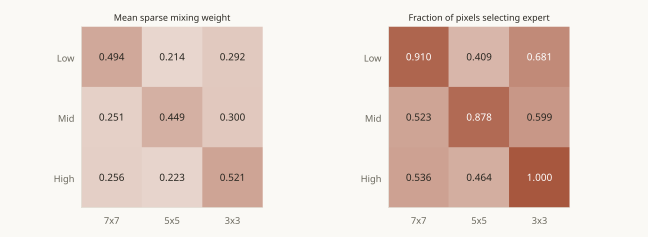

Routing diagnostics use ten source images and eight degradation seeds per image. Thus, 80 observations represent ten independent image sources. The high-band 3x3 expert has selection fraction 0.999845. Mean high-band weights remain approximately 0.256 for 7x7 and 0.223 for 5x5, indicating continued contribution from both larger-kernel experts.

Figure 22. Spatial routing for 0834.png at image-index seed 33. Rows denote low, mid, and high bands. Columns contain the degraded center crop and expert weights for 7x7, 5x5, and 3x3 kernels. All weights use the same 0-1 color scale. Source: diagnostics/routing_0834.png.


Spatial selection changes when expert logits exchange rank. Consequently, smooth dense probabilities can yield discontinuous selected-pair boundaries. These maps characterize the gate output; they do not identify the causal contribution of an expert to a specific restored structure.


## Routing dependence and interventions

Figure 23. Within-image-centered Pearson correlations between mean routing weights and degradation parameters, with paired inference interventions on ten images. Points show individual intervention responses; horizontal segments show their means.

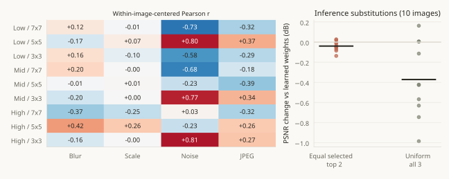

Correlation analysis subtracts each image's eight-sample mean from the routing and degradation variables. High-band 3x3 weight correlates +0.809 with noise sigma. Low-band 5x5 weight correlates +0.798, while low-band 7x7 weight correlates -0.728. These values describe degradation dependence within the selected image sample.

Blur, scale, noise, and JPEG quality vary simultaneously. The analysis contains 36 exploratory correlations, without a controlled single-parameter sweep, image-level uncertainty estimates, or multiple-comparison correction. Causal disentanglement and general expert specialization cannot be inferred from these correlations.

| Inference intervention | Mean PSNR change | Minimum / maximum |
| --- | --- | --- |
| Equal weights on the selected pair | -0.039582 dB | -0.13722 / +0.02765 dB |
| Uniform weights across three experts | -0.371954 dB | -0.98573 / +0.16298 dB |

Interventions preserve the completed checkpoint's expert weights. Equal selected-pair weighting retains learned pair selection. Uniform weighting activates all three expert contributions at every location, including previously excluded contributions. The mean losses measure dependence on the learned inference policy.

The trained uniform comparison on page 22 uses matched initialization and optimization settings. It tests removal of the learned routing mechanism during training, rather than substitution after training.


## Trained routing ablation

At the 01 October 2026, 03:45 IST cutoff, both private Kaggle experiments remain active. The reference reaches logged step 6,000 in 1,072 training seconds. Uniform routing reaches step 6,250 in 993 seconds. Both experiments target 100,000 updates with seed 1234. Final 100-image results are not available.

Figure 24. Interim PSNR on 16 fixed validation crops, rounded to 0.01 dB. At the common 6,000-step observation, reference PSNR is 28.07 dB and uniform PSNR is 28.36 dB. The 0.29 dB difference describes incomplete training.

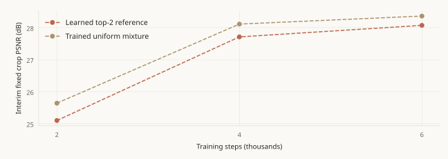

| Setting | Reference | Uniform |
| --- | --- | --- |
| Expert initialization and widths | Identical | Identical |
| Spatial mixing | Learned top 2 of 3 | All three weights = 1/3 |
| Entropy coefficient | 0.01, annealed to zero | 0.0 |
| Gate parameters | 681 trainable | 681 retained, frozen, and skipped |
| Stored / trainable parameters | 97,088 / 97,088 | 97,088 / 96,407 |
| Schedule and seed | 100,000 steps; seed 1234 | 100,000 steps; seed 1234 |

Pre-training checks verify identical initialization, default top-2 selection, uniform weight sums, expert gradients, and absent uniform-gate gradients. Keeping the frozen gate preserves the random initialization order of subsequent modules. The uniform forward pass omits gate computation.

The ablation removes learned routing and entropy regularization together. It therefore estimates their combined effect rather than the independent effect of entropy. The seeded 100,000-step reference is the matched comparator; the original 200,000-step run uses a different schedule. Sessions have a six-hour limit and a 5.5-hour training cutoff, followed by full validation if training completes.


## Implementation issues and corrections

Recorded issues concern data throughput, incomplete logs, notebook execution, and interpretation of evaluation results. The following corrections define the experimental conditions used in this report.

| Issue | Resolution or experimental consequence |
| --- | --- |
| Repeated high-resolution PNG decoding | A training-only uint8 tile cache replaces per-crop PNG decoding. Degradation and augmentation remain online. Warmed throughput is measured separately. |
| Missing Gaussian logs and checkpoint rewind | Available observations are retained without interpolation across missing intervals. Final baseline evaluation uses checkpoint 286,000. |
| Clipped and unclipped Gaussian protocols | Historical clipped-noise DnCNN results remain separate from the author-protocol FFDNet result of 31.219812 dB. |
| Crop and full-image validation | FCSG-Net crop PSNR is 30.592 dB; final 100-image PSNR is 27.242896 dB. Each result retains its evaluation protocol. |
| Diagnostic version 1: undefined digest | The notebook setup variable is corrected. Execution fails before diagnostic measurements, so this version contributes no result. |
| Diagnostic version 2: negation after tolist() | Negation is applied to the tensor before conversion to a list. A synthetic statistics check verifies the expression; version 3 completes successfully. |
| FLOPs used as a proxy for latency | A direct FP32 T4 microbenchmark measures FCSG-Net as slower than DnCNN and FFDNet despite its lower arithmetic estimate. |
| Sparse mixing interpreted as sparse execution | All expert outputs are computed. The implementation provides sparse weights without conditional expert dispatch. |
| Inference changes interpreted as trained ablations | Inference interventions remain separate from the active matched reference and uniform-training pair. |
| Different D2 archive hashes across exports | Archive hashes are associated with their individual export runs. The paired-data manifest identifies data content independently of the ZIP archive. |

Sources: surviving training logs, corrected evaluation and notebook sources, diagnostics version 3 job metadata, observed version 1 and version 2 execution failures, and milestone JSON records.


## Conclusions and further experiments


### Conclusions

FCSG-Net passes reconstruction, tensor-shape, gradient, mixed-precision, and checkpoint-restoration checks. It completes composite training within the selected parameter and arithmetic limits. On the evaluated T4 configuration, its final checkpoint has lower restoration quality and higher measured forward latency than the compared convolutional baselines.

The learned gate varies spatially and correlates with degradation parameters in the diagnostic subset. Inference substitutions reduce mean PSNR, indicating dependence on the trained mixing policy. A benefit from learned routing during training remains unresolved until the matched ablation completes.


### Limitations

| Missing measurement | Effect on interpretation |
| --- | --- |
| Repeated training seeds and independent test data | Training-run variance and untouched test-set generalization are not estimated |
| Real archival images and human assessment | Synthetic restoration results do not establish performance on real archival photographs |
| Operator profiles and end-to-end latency | Individual runtime costs and deployment throughput are not established |
| Batch-16 peak training memory and other GPUs | Batch-1 T4 verification does not establish training memory or RTX 3050 compatibility |
| Trained component ablations | Hard masks, band removal, global routing, and frequency-loss removal have not been independently evaluated |
| Full restored images and residual maps | Saved image panels are insufficient for complete spatial error analysis |


### Further experiments

The immediate experiment is completion of the seeded routing pair, followed by source and checkpoint verification and full-image PSNR, SSIM, LPIPS, and timing analysis. The 100,000-step pair remains separate from the earlier 200,000-step comparison.

Additional seeds are required to estimate the stability of any routing effect. Separate entropy and selection ablations can identify which component contributes to a difference. Operator profiling is required before optimization for conditional dispatch. Independent synthetic and real-image evaluation is required to assess generalization.

The late validation plateau provides no direct evidence that extending the unchanged configuration would remove the observed restoration deficit.


## Experimental provenance

Evaluation JSON and training-log hashes match the recorded Phase 3 manifest. Model computation runs on Kaggle; report generation reads stored numerical records and saved image panels. The accompanying evidence_index.json lists the included source and result files with SHA-256 hashes.

| Experiment records | Location |
| --- | --- |
| Gaussian baseline | results/benchmark.csv; checkpoints/train_log.csv |
| Milestone verification | results/milestone_run_20260923.ipynb; results/milestone_run_20260925/*.json |
| Composite training and evaluation | results/phase3/{config}/evaluation.json, status.json, train_log.csv, figures/ |
| Per-image metrics and source manifest | results/phase3/per_image_scores.csv; source_manifest.json |
| Checkpoint diagnostics | results/diagnostics/summary.json, routing.json, tiles.csv, interventions.csv, job.json |
| Active routing pair | results/phase4/jobs.json; fcsg-report-assets/live_snapshot.json and live_*.csv |


### Submitted source bundles

The four original composite experiments use the same 21-file source bundle, SHA-256 85d6e16f72ead013faf6c0a3655d400b3b8ca80f2f14693b25943db67e8022dd. This identity predates subsequent diagnostic and ablation changes.

Diagnostic bundle SHA-256: d473bc10b0ad0c1ed50bd7b885c3b81fe85c4dbde9d5e61f139dd24cae019102. Seeded ablation bundle SHA-256: 4617fba4429c7b7fb18f14e553c18c15dd2032b379a4d493c6dc630404e9e431. Submitted manifests define the source used for each experiment independently of later working-tree edits.

D2 export, 25 September: archive SHA-256 394c4410ab6b125563353897d7221d9ffd9ef15f810aaec1cc300c8499147f5f; paired-data manifest SHA-256 7ce7f310bdb4d2d5877f92cabec4551c0ebd025931383901468380a070894514. The 23 September export records a different archive hash, 271ae6c5...e4e4. Archive identity is specific to each export.


### Evaluated checkpoints

FCSG-Net: 8db0bb0f3c251ddcf3cb6c852c087a0127b749297a436f526f44f9eb8d3b6920

DnCNN: afb0abfa022ede04bb90d63c2fbf3c2880bd9cc33e497e50aaf24f7e15c0139b

FFDNet blind: 981560c18cbea13749fc400207f8b306015376b2437a3aec9f561d9ea960eb85

FFDNet oracle: ef9560e8ed1ebae0a95fbd8503bc378bf98c7feaa316a6425d5eac89dce40f77

The evidence archive contains metric files, logs, configurations, source records, manifests, and report assets. Model checkpoints and image datasets are excluded. Their identifiers remain in the provenance records.


## References

[R1] Zhang et al. Beyond a Gaussian Denoiser: Residual Learning of Deep CNN for Image Denoising. IEEE TIP, 2017.
[https://arxiv.org/abs/1608.03981](https://arxiv.org/abs/1608.03981)

[R2] Zhang, Zuo, and Zhang. FFDNet: Toward a Fast and Flexible Solution for CNN based Image Denoising. IEEE TIP, 2018. Color CBSD68 sigma-25 result in Table V.
[https://arxiv.org/abs/1710.04026](https://arxiv.org/abs/1710.04026)

[R3] Zhang et al. KAIR FFDNet inference implementation and pretrained color checkpoint.
[https://github.com/cszn/KAIR/blob/master/main_test_ffdnet.py](https://github.com/cszn/KAIR/blob/master/main_test_ffdnet.py)

[R4] Liu et al. Multi-level Wavelet-CNN for Image Restoration. CVPR Workshops, 2018.
[https://arxiv.org/abs/1805.07071](https://arxiv.org/abs/1805.07071)

[R5] Cui et al. Selective Frequency Network for Image Restoration. ICLR, 2023. Author implementation.
[https://github.com/c-yn/SFNet](https://github.com/c-yn/SFNet)

[R6] Shazeer et al. Outrageously Large Neural Networks: The Sparsely-Gated Mixture-of-Experts Layer. 2017.
[https://arxiv.org/abs/1701.06538](https://arxiv.org/abs/1701.06538)

[R7] Hu, Shen, and Sun. Squeeze-and-Excitation Networks. CVPR, 2018.
[https://arxiv.org/abs/1709.01507](https://arxiv.org/abs/1709.01507)

[R8] Zhang et al. The Unreasonable Effectiveness of Deep Features as a Perceptual Metric. CVPR, 2018.
[https://arxiv.org/abs/1801.03924](https://arxiv.org/abs/1801.03924)

[R9] Agustsson and Timofte. NTIRE 2017 Challenge on Single Image Super-Resolution: Dataset and Study. DIV2K dataset.
[https://data.vision.ee.ethz.ch/cvl/DIV2K/](https://data.vision.ee.ethz.ch/cvl/DIV2K/)


### Reproducibility notes

Literature establishes the methodological context. Experimental metrics are taken from the repository records identified on page 25. Original aggregate precision is retained; per-image and interim values use the precision available in console logs.

Single training runs do not support estimates of training-seed uncertainty. Diagnostic subsets are reported separately from full validation. Qualitative image labels use whole-image PSNR. The active ablation remains an interim result.

The report is generated by evaluation/build_technical_report.py from fixed evidence files, including the frozen live_snapshot.json. The accompanying source and figures allow regeneration without querying active experiments or executing restoration models.


## Appendix: per-image PSNR (1/3)

DIV2K composite validation with 256-pixel tiles and 32-pixel overlap. All values are dB, rounded to 0.01 in console output. Input degradation is identical across models. Per-image SSIM and LPIPS are preserved in the evidence CSV.

| Image | Input | FCSG | DnCNN | FFD blind | FFD oracle |
| --- | --- | --- | --- | --- | --- |
| 0801.png | 28.09 | 29.32 | 28.22 | 29.37 | 29.39 |
| 0802.png | 27.37 | 32.99 | 33.95 | 33.93 | 34.12 |
| 0803.png | 15.71 | 32.08 | 33.77 | 34.48 | 34.47 |
| 0804.png | 16.16 | 26.43 | 26.95 | 27.06 | 27.03 |
| 0805.png | 14.82 | 25.64 | 25.82 | 25.97 | 25.95 |
| 0806.png | 18.14 | 26.08 | 26.57 | 26.82 | 26.82 |
| 0807.png | 18.11 | 20.15 | 20.51 | 20.63 | 20.65 |
| 0808.png | 16.25 | 25.33 | 25.80 | 25.92 | 25.93 |
| 0809.png | 22.81 | 31.48 | 31.57 | 31.52 | 31.56 |
| 0810.png | 16.54 | 25.26 | 25.48 | 25.61 | 25.63 |
| 0811.png | 15.96 | 26.17 | 26.43 | 26.58 | 26.61 |
| 0812.png | 17.27 | 27.94 | 28.60 | 28.87 | 28.91 |
| 0813.png | 28.36 | 31.12 | 31.28 | 31.86 | 31.84 |
| 0814.png | 15.68 | 26.02 | 26.52 | 26.73 | 26.74 |
| 0815.png | 17.65 | 29.16 | 29.74 | 30.01 | 30.05 |
| 0816.png | 25.01 | 29.70 | 30.11 | 30.49 | 30.54 |
| 0817.png | 29.35 | 30.91 | 31.27 | 31.97 | 32.10 |
| 0818.png | 17.80 | 26.17 | 26.89 | 27.14 | 27.16 |
| 0819.png | 25.06 | 27.89 | 28.17 | 28.18 | 28.20 |
| 0820.png | 20.31 | 24.74 | 26.03 | 26.22 | 26.23 |
| 0821.png | 27.80 | 29.79 | 31.93 | 31.79 | 31.89 |
| 0822.png | 17.92 | 26.53 | 27.18 | 27.42 | 27.47 |
| 0823.png | 26.21 | 27.23 | 27.79 | 28.18 | 28.26 |
| 0824.png | 25.07 | 26.91 | 27.88 | 28.48 | 28.51 |
| 0825.png | 21.15 | 26.56 | 27.46 | 27.59 | 27.64 |
| 0826.png | 25.15 | 25.76 | 27.29 | 27.15 | 27.52 |
| 0827.png | 30.95 | 32.97 | 34.00 | 34.11 | 34.15 |
| 0828.png | 17.10 | 17.93 | 18.76 | 18.61 | 18.83 |
| 0829.png | 15.75 | 25.16 | 25.43 | 25.50 | 25.52 |
| 0830.png | 17.82 | 25.62 | 26.30 | 26.44 | 26.52 |
| 0831.png | 29.44 | 31.39 | 29.73 | 33.24 | 33.46 |
| 0832.png | 20.16 | 26.22 | 27.15 | 27.54 | 27.61 |
| 0833.png | 25.07 | 32.75 | 33.64 | 34.12 | 34.17 |
| 0834.png | 16.05 | 24.38 | 24.65 | 24.86 | 24.90 |

Source: results/phase3/per_image_scores.csv. Aggregate means appear on page 12. Equal values at displayed precision do not establish exact equality.


## Appendix: per-image PSNR (2/3)

DIV2K composite validation with 256-pixel tiles and 32-pixel overlap. All values are dB, rounded to 0.01 in console output. Input degradation is identical across models. Per-image SSIM and LPIPS are preserved in the evidence CSV.

| Image | Input | FCSG | DnCNN | FFD blind | FFD oracle |
| --- | --- | --- | --- | --- | --- |
| 0835.png | 23.60 | 24.20 | 24.43 | 24.51 | 24.55 |
| 0836.png | 15.53 | 24.62 | 25.50 | 25.79 | 25.81 |
| 0837.png | 15.65 | 25.12 | 25.92 | 26.10 | 26.08 |
| 0838.png | 29.15 | 36.42 | 36.36 | 36.85 | 36.92 |
| 0839.png | 17.69 | 27.62 | 28.06 | 28.19 | 28.23 |
| 0840.png | 27.16 | 28.72 | 29.08 | 29.07 | 29.11 |
| 0841.png | 17.67 | 25.44 | 25.90 | 26.09 | 26.15 |
| 0842.png | 26.95 | 28.23 | 26.16 | 28.87 | 28.91 |
| 0843.png | 20.44 | 33.54 | 35.45 | 36.51 | 37.02 |
| 0844.png | 36.25 | 38.57 | 41.00 | 41.39 | 41.43 |
| 0845.png | 23.08 | 24.37 | 26.39 | 26.67 | 26.75 |
| 0846.png | 16.09 | 23.35 | 24.52 | 24.95 | 25.00 |
| 0847.png | 23.40 | 25.23 | 25.60 | 26.37 | 26.44 |
| 0848.png | 21.99 | 25.11 | 25.80 | 26.04 | 26.10 |
| 0849.png | 19.78 | 21.66 | 22.61 | 22.72 | 22.82 |
| 0850.png | 21.91 | 28.08 | 28.95 | 29.10 | 29.15 |
| 0851.png | 20.99 | 26.38 | 26.99 | 27.24 | 27.26 |
| 0852.png | 26.22 | 28.10 | 28.52 | 28.64 | 28.69 |
| 0853.png | 19.11 | 30.17 | 31.31 | 31.76 | 31.86 |
| 0854.png | 22.68 | 25.98 | 26.73 | 26.85 | 26.90 |
| 0855.png | 28.26 | 30.76 | 30.76 | 30.97 | 31.14 |
| 0856.png | 21.16 | 23.11 | 23.49 | 23.72 | 23.76 |
| 0857.png | 13.93 | 31.57 | 32.51 | 32.84 | 32.89 |
| 0858.png | 16.78 | 25.84 | 26.08 | 26.22 | 26.20 |
| 0859.png | 23.45 | 26.21 | 26.47 | 26.57 | 26.59 |
| 0860.png | 20.09 | 21.16 | 21.46 | 21.79 | 21.79 |
| 0861.png | 23.50 | 24.14 | 26.18 | 26.43 | 26.61 |
| 0862.png | 16.49 | 31.37 | 31.67 | 31.84 | 31.85 |
| 0863.png | 17.92 | 30.30 | 30.76 | 30.97 | 31.04 |
| 0864.png | 26.45 | 29.58 | 29.89 | 30.00 | 30.03 |
| 0865.png | 25.90 | 26.44 | 26.64 | 26.88 | 26.94 |
| 0866.png | 20.34 | 26.43 | 26.77 | 26.67 | 26.76 |
| 0867.png | 25.37 | 26.71 | 27.57 | 28.14 | 28.16 |
| 0868.png | 19.78 | 31.52 | 32.57 | 32.95 | 33.01 |

Source: results/phase3/per_image_scores.csv. Aggregate means appear on page 12. Equal values at displayed precision do not establish exact equality.


## Appendix: per-image PSNR (3/3)

DIV2K composite validation with 256-pixel tiles and 32-pixel overlap. All values are dB, rounded to 0.01 in console output. Input degradation is identical across models. Per-image SSIM and LPIPS are preserved in the evidence CSV.

| Image | Input | FCSG | DnCNN | FFD blind | FFD oracle |
| --- | --- | --- | --- | --- | --- |
| 0869.png | 16.42 | 23.38 | 23.58 | 23.70 | 23.71 |
| 0870.png | 15.03 | 25.92 | 26.23 | 26.35 | 26.38 |
| 0871.png | 26.18 | 30.26 | 30.48 | 31.07 | 31.01 |
| 0872.png | 16.17 | 23.71 | 24.13 | 24.22 | 24.25 |
| 0873.png | 22.14 | 23.12 | 23.43 | 23.70 | 23.79 |
| 0874.png | 22.38 | 29.50 | 30.14 | 30.21 | 30.17 |
| 0875.png | 15.92 | 22.12 | 22.67 | 22.81 | 22.84 |
| 0876.png | 18.52 | 22.49 | 22.90 | 22.99 | 23.06 |
| 0877.png | 17.99 | 31.10 | 33.85 | 34.22 | 34.20 |
| 0878.png | 22.03 | 29.44 | 30.80 | 31.10 | 31.14 |
| 0879.png | 21.48 | 26.76 | 27.56 | 27.73 | 27.78 |
| 0880.png | 14.46 | 28.40 | 28.77 | 29.01 | 29.01 |
| 0881.png | 25.37 | 26.27 | 25.34 | 27.01 | 27.07 |
| 0882.png | 15.19 | 29.44 | 30.54 | 30.90 | 30.89 |
| 0883.png | 21.42 | 24.63 | 25.12 | 25.35 | 25.32 |
| 0884.png | 18.18 | 25.42 | 26.04 | 26.20 | 26.25 |
| 0885.png | 15.06 | 21.67 | 21.95 | 22.08 | 22.12 |
| 0886.png | 19.79 | 33.56 | 34.28 | 34.55 | 34.63 |
| 0887.png | 20.01 | 24.35 | 24.85 | 24.99 | 25.02 |
| 0888.png | 25.69 | 29.19 | 29.76 | 30.10 | 30.13 |
| 0889.png | 17.31 | 28.06 | 28.44 | 28.57 | 28.54 |
| 0890.png | 17.79 | 24.46 | 24.69 | 24.78 | 24.78 |
| 0891.png | 20.27 | 25.32 | 26.51 | 26.73 | 26.77 |
| 0892.png | 15.73 | 26.36 | 27.55 | 27.83 | 27.82 |
| 0893.png | 24.56 | 31.10 | 31.73 | 31.87 | 31.94 |
| 0894.png | 22.61 | 28.07 | 28.85 | 29.21 | 29.25 |
| 0895.png | 15.54 | 20.98 | 21.17 | 21.21 | 21.25 |
| 0896.png | 28.23 | 34.86 | 35.13 | 36.53 | 36.60 |
| 0897.png | 17.12 | 21.11 | 21.44 | 21.52 | 21.49 |
| 0898.png | 19.19 | 31.20 | 32.31 | 32.57 | 32.60 |
| 0899.png | 25.23 | 26.20 | 24.41 | 28.13 | 28.09 |
| 0900.png | 19.34 | 26.03 | 27.46 | 27.65 | 27.67 |

Source: results/phase3/per_image_scores.csv. Aggregate means appear on page 12. Equal values at displayed precision do not establish exact equality.
